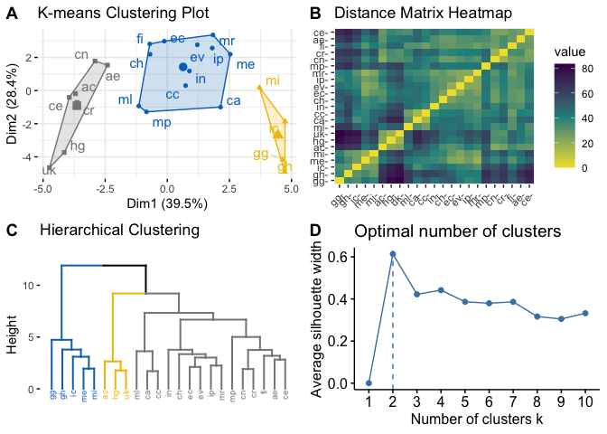

---
editor_options:
  markdown:
    wrap: 72
---

<!-- README.md is generated from README.Rmd. Please edit that file -->

# chooseGCM

<!-- badges: start -->

<!-- badges: end -->

The goal of chooseGCM is to help researchers aiming to project Species
Distribution Models and Ecological Niche Models to future scenarios by
applying a selection routine to the General Circulation Models.

## Installation

You can install the development version of chooseGCM from
[GitHub](https://github.com/) with:

```{r, eval=F}
install.packages("devtools")
devtools::install_github("luizesser/chooseGCM")
```

## Tutorial

This is a basic tutorial which shows you how to use the functions in
chooseGCM. After installing the package, we need to open it:

```{r}
library(chooseGCM)
```

### Downloading WorldClim 2.1 data

First, we need to use only one time period. Here we use 2090 so the
difference between models is more conspicuous. In the same way we are
considering the SSP585, which is the more dramatic pathway. The
resolution is the lowest to be quicker. The aim here is to maintain all
parameters equal, but General Circulation Models (GCMs). In this way we
know that the only source of variation comes from them. Note that if you
receive a timeout error you can increase timeout value by running ,
where 600 is the value in seconds that will be enough to download the
data.

```{r}
WorldClim_data(period = 'future', variable = 'bioc', year = '2090', gcm = 'all', ssp = '585', resolution = 10)
```

### Importing and transforming data

Now let's import GCMs to R in a list of stacks and name the list with
the names of the GCMs.

```{r}
s <- import_gcms()
names(s) <- gsub("_ssp585_10_2090","",names(s))
```

In each function, data will be transformed. To do that you will always
need to provide at least: (1) the list of stacks, (2) the variables you
want to use in analysis and (3) the shapefile of your study area. You
don't need to mask and subset your data, once the functions will perform
this task internally for you. We will analyze data through this file in
two ways: the straightforward and the deep-dive approach. In the fist,
we will simply go directly to a wrapper provided by the package, while
in the second, we will use Paraná river basin data to search for the
optimal GCMs.

```{r}
var_names <- c('bio_1', 'bio_12')
study_area_parana <- sf::st_read('input_data/PR_UF_2022.shp')
```

### Straigthforward Approach

There is the option to run each function in separate to better
understand what is happening and to better parameterize each step.
However there is a wrapper to help run everything at once:

```{r}
compare_gcms(s, var_names, study_area_parana, k = 3)
```

{width="100%"}

### Deep-dive Approach

#### Exploratory analysis

In chooseGCM we implemented functions to analyze GCMs attributes.

```{r}
# Summary of GCMs
s_sum <- summary_gcms(s, var_names, study_area_parana)
s_sum
```

```{r}
# Pearson Correlation between GCMs
s_cor <- cor_gcms(s, var_names, study_area_parana, method = "pearson")
s_cor
```


```{r}
# Euclidean Distance between GCMs
s_dist <- dist_gcms(s, var_names, study_area_parana, method = "euclidean")
s_dist
```


#### Obtain clusters

Clusters in chooseGCM are obtained through k-means, a unsupervised
machine learning algorithm. k is the number of clusters, which in this
case is the number of GCMs the modeler wants to use in projections.To
build a distance matrix considering multiple variables to each GCM we
use a flattening strategy, where values are concatenated in one unique
vector to each GCM. In the process, we need to scale variables so they
end up with the same measure. This matrix will be used to calculate the
clusters.

```{r}
kmeans_gcms(s, var_names, study_area_parana, k = 3,  method = "euclidean")
```


Alternatively, one could run the analysis with raw environmental data by
not setting any value to method (note how axis change).

```{r}
kmeans_gcms(s, var_names, study_area_parana, k = 3)
```


We can also obtain clusters through hierarchical clustering.

```{r}
hclust_gcms(s, var_names, study_area_parana, k = 3, n = 1000)
```


But how many clusters are good? There is three metrics implemented to
understand that.

```{r}
optk_gcms(s, var_names, study_area_parana, method = 'wss', n = 1000)
```


```{r}
optk_gcms(s, var_names, study_area_parana, method = 'silhouette', n = 1000)
```


```{r}
optk_gcms(s, var_names, study_area_parana, method = 'gap_stat', n = 1000)
```


### 
